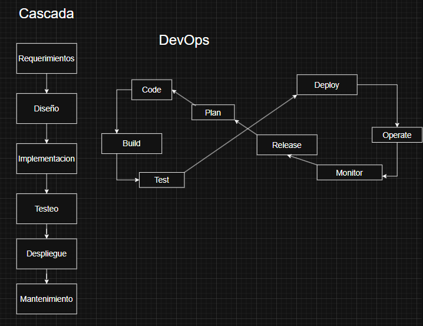

# Actividad 1
### Nombre: Edy Saul Serrano Arostegui
### Fecha y tiempo total invertido (08:30)
* Todo este trabajo se realizo en Windows con visual studio code y algunas fuentes que han sido registradas en el archivo **FUENTES.md**.

# 

# 1. DevOps vs. Cascada tradicional

**Diagrama:** 

## Por qué DevOps acelera y reduce riesgo frente a la metodologia en cascada?

1. **Feedback continuo:**

    En DevOps, las pruebas, el monitoreo y la retroalimentación de los usuarios ocurren de forma constante y desde el inicio, esto detecta defectos o errores antes de que escalen, reduciendo costos y riesgos de fallas graves en producción.
    En cascada, el feedback llega tarde (fase de pruebas o incluso en despliegue), acumulando errores ya que en esta metodologia no existe el retroceso hacia una fase anterior en el transcurso del desarrollo, eso aumenta no solo el riesgo sino el tiempo de despliegue.

2. **Pequeños lotes de entrega:**

    DevOps promueve releases frecuentes e incrementales, ya que los cambios son pequeños por lo tanto más fáciles de probar, revertir y auditar.
    En cascada, los entregables son grandes por ende difícil aislar errores y el rollback es muy costoso.

3. **Automatización (CI/CD + IaC):**

    Integración, pruebas y despliegue automáticos eliminan tareas manuales propensas a error.
    En la nube, esto se combina con infraestructura como código el cual es reproducible y seguro.
    Y la cascada depende de procesos manuales largos y pesados, con mayor riesgo humano de por mediio.

## Contexto real donde un enfoque cercano a cascada sigue siendo razonable

### **Desarrollo de software embebido en sistemas de aviación [(DO-178C)](https://en.wikipedia.org/wiki/DO-178C):** 

#### **Criterios verificables:**

* **Regulación estricta de certificación:**

    * Cada fase (requisitos -> diseño -> implementación -> pruebas) debe documentarse y validarse formalmente.

    * Auditores externos requieren trazabilidad completa entre cada requisito y su implementación.

* **Fuerte acoplamiento hardware-software:**

    * El software depende de hardware específico certificado (sensores, actuadores).

    * Las pruebas en entornos de producción solo son posibles al final.

    * Verificable porque el hardware suele tener versiones fijas con contratos de mantenimiento largos.

#### **Trade-offs:**
* Velocidad vs. Conformidad: DevOps es rápido, pero en este caso la prioridad es cumplir con la norma y pasar auditorias y cascada asegura trazabilidad formal.

* Velocidad vs. Seguridad: DevOps entrega pronto, pero en aviación el riesgo de un fallo supera los beneficios de rapidez entonces se sacrifica velocidad por seguridad y estabilidad certificada.

#

# 2. Ciclo tradicional de dos pasos y silos (limitaciones y anti-patrones)

**Silos:**

## Limitaciones del ciclo “construcción → operación” sin integración continua

1. **Grandes lotes:**
    * Cuando se acumulan cambios de semanas o meses antes de liberar, cada entrega se convierte en un **paquete gigante**.
    * Esto genera hand-offs (traspasos de un equipo a otro) muy costosos porque el codigo ya esta desacoplado de la realidad de producción y requiere tiempo extra de pruebas y resolución de conflictos.
    * Tambien el costo de integracion aumenta exponencialmente mientras mas tarde se haga, porque los defectos se van a detectar despues de que multiples modulos ya dependen de ellos.

2. **Colas de defectos:**
    * Los bugs se acumulan como tickets en un backlog, en lugar de resolverse en el mismo flujo donde se introducen.
    * Esto crea una asimetría osea quienes desarrollaron ya no recuerdan el contexto completo, y quienes operan solo ven los *sintomas* en produccion.
    * El tiempo para reconstruir alarga la resolución y reduce la calidad.

## Anti-patrones y su efecto en incidentes

1. **Throw over the wall:**
    * Significa que desarrollo entrega a operaciones sin compartir contexto, asumiendo que **ya no es mi problema**.
    * Este handoff aumenta el MTTR (Mean Time to Recovery) porque el equipo de operaciones tiene que diagnosticar a ciegas.
    * Como resultado: mas trabajo, llamadas de emergencia a desarrollo lo que consume tiempo y recursos.

2. **Seguridad como auditoría tardía:**
    * La seguridad solo se revisa al final, después de que todo esta **terminado**.
    * Esto introduce un costo de integracion tardia enorme, porque los hallazgos requieren reabrir codigo que ya paso por QA, documentacion y hasta despliegues.
    * Se genera retrabajo en cadena y, peor aun, si algo se omite, la misma vulnerabilidad puede reaparecer en cada release lo que es una degradacion repetitiva.

#

# 3. Principios y beneficios de DevOps (CI/CD, automatización, colaboración; Agile como precursor)

DevOps integra la automatizacion, colaboracion y entrega continua para reducir fricción entre desarrollo y operaciones, sus raices estan en Agile, que ya planteaba ciclos cortos y feedback frecuente.

## Principios y beneficios de DevOp
1. **CI (Integración Continua):**
    * Cambios pequeños y frecuentes que se integran a la rama **Main**.
    * Pruebas automatizadas, asegurando que cada commit mantiene el sistema estable.
    * Fomenta colaboracion porque los errores se detectan en minutos y no en semanas.

2. **CD (Entrega/Despliegue Continuo):**
    * Los cambios validados en CI se promueven automaticamente a entornos superiores (staging, producción) si pasan las pruebas.
    * El tamaño reducido de los cambios facilita reversion y disminuye riesgo.
    * Requiere coordinacion entre Dev y Ops, ya que los despliegues son frecuentes y deben monitorearse de inmediato.

## Practicas Agile que alimentan al pipeline
* **Reuniones diarias (daily stand-ups)**: revelan bloqueos de codigo o dependencias criticas y esa informacion alimenta cambios del pipeline.

* **Retrospectivas:** identifican patrones de incidentes o friccion (ejemplo: demasiados hotfixes en produccion), esto puede derivar en automatizar pruebas adicionales o bien establecer criterios de bloqueo mas estrictos antes del despliegue.

## Indicador observable de colaboración Dev–Ops
Tiempo desde que un Pull Request está marcado como “listo” hasta que se despliega en entorno de pruebas.
Por que mide colaboracion: refleja que tan coordinados estan Dev y Ops, si Dev integra rapido pero Ops demora dias en desplegar, hay friccion, con una cultura DevOps bien integrada, este tiempo se acorta porque el pipeline automatizado toma el relevo sin esperas manuales.

## Cómo recolectar este indicador sin herramientas pagas

1. **Metadatos de PRs (GitHub/GitLab):** Registrar timestamp (marca de tiempo) cuando el PR pasa a “Ready for review” o “Merged”.

2. **Registros de despliegue (logs de CI/CD, bitácoras de scripts, git log + anotaciones de pipeline):** Marcar timestamp (marca de tiempo) del primer despliegue en entorno de pruebas.

3. **Calcular diferencia:** Un simple script en Python o Bash puede correlacionar ambos timestamps (marca de tiempo).

#

# 4. Evolución a DevSecOps (seguridad desde el inicio: SAST/DAST; cambio cultural)

## [(SAST VS. DAST)](https://circleci.com/blog/sast-vs-dast-when-to-use-them/) en el pipeline.

1. **SAST (Static Application Security Testing):**
    * Analiza el codigo fuente o compilado sin ejecutarlo.
    * Se ubica temprano en el pipeline, cerca de CI (cada commit o PR).
    * Permite detectar vulnerabilidades de forma anticipada como inyeccion SQL en el codigo. 

2. **DAST (Dynamic Application Security Testing):**
    * Analiza la aplicacion en ejecucion, simulando ataques externos.
    * Se ubica en staging/preproduccion, cuando la app ya corre en un entorno realista.
    * Detecta vulnerabilidades como XSS, autenticación debil y exposicion de headers.

## Gate mínimo de seguridad con umbrales
1. **Bloqueo por severidad crítica:**
    * Regla: “Cualquier hallazgo crítico en componentes expuestos bloquea la promoción”.
    
2. **Cobertura mínima de pruebas de seguridad:**
    * Regla: “Cobertura minima de pruebas de seguridad ≥ 80% de endpoints criticos”.

## Política de excepción
Se aplica cuando no es posible corregir un hallazgo inmediatamente:

* **Excepcion temporal:** Expira en maximo 30 dias.

* **Responsable asignado:** El Tech-Lead del equipo dueño del servicio.

* **Plan de correccion:** Ticket en backlog con prioridad alta, con su fecha limite documentada y seguimiento en retrospectiva.

*Nota: Un Tech Lead es el desarrollador mas experimentado que guia al equipo en decisiones tecnicas, buenas practicas y calidad del software.*

## Evitar el teatro de seguridad

#### Señales de eficacia:

1. **Disminucion de hallazgos repetidos:**

    * **Medicion:** comparar hallazgos de la misma categoria en dos trimestres consecutivos.

    * **Señal de eficacia:** menos vulnerabilidades reincidentes indica que se corrigio la causa raíz.

2. **Reduccion en tiempo de remediacion (MTTR de vulnerabilidades):**

    * **Medicion:** calcular diferencia entre timestamp de deteccion y timestamp de cierre de cada vulnerabilidad.
    
    * **Señal de eficacia:** si antes un hallazgo critico tardaba 20 días y ahora 7, el proceso es mas agil y reduce exposicion al riesgo.

#

# 5. CI/CD y estrategias de despliegue (sandbox, canary, azul/verde)

## Canary en el pipeline

## Estrategia de despliegue
Para un microservicio critico como autenticacion, la estrategia mas adecuada es [canary](https://octopus.com/devops/software-deployments/canary-deployment/) ya que:

* Permite exponer la nueva version solo a una fraccion de usuarios o trafico.

* Minimiza el riesgo: si algo falla, el impacto es limitado y se puede hacer rollback rapido.

* Es mas eficiente que azul/verde cuando el costo de recursos es sensible, pero se requiere validar en produccion real.

## Riesgos vs Mitigaciones
| Riesgo                              | Mitigacion                                                       |
|-------------------------------------|-------------------------------------------------------------------|
| Regresion funcional                  | Validacion de contrato (API contract testing) antes de promover.  |
| Costo operativo del doble despliegue | Limites de tiempo de convivencia como canary < 24h.              |
| Manejo de sesiones                   | "Draining" de conexiones y compatibilidad de esquemas de sesion. |

## KPI primario para el gate
* **KPI:** tasa de errores HTTP 5xx.
* **Umbral:** < 0.5% de requests con 5xx durante una ventana de 15 minutos de observacion.
* **Accion:**
    * Si el KPI se mantiene bajo el umbral entonces promocion completa.
    * Si supera el umbral entonces abortar despliegue y rollback.

## Pregunta retadora: coexistencia de metricas tecnicas y de producto
Incluso si el KPI técnico (errores 5xx, latencia p95) esta en verde, una metrica de producto puede caer.
Por eso, los gates de despliegue deben considerar ambos mundos:

* **Metricas tecnicas:** aseguran estabilidad y confiabilidad.

* **Metricas de producto:** aseguran que el cambio no erosiona la experiencia del usuario ni el negocio.

*Nota: Un KPI (Key Performance Indicator o Indicador Clave de Desempeño) es una metrica medible que se usa para evaluar si un proceso, sistema o equipo esta cumpliendo con un objetivo especifico.*

# 

# 6. Fundamentos prácticos sin comandos

## 6.1 HTTP - contrato observable

* **Método:** GET

* **Código de estado:** 200 OK

* **Cabeceras clave:**

    * Cache-Control: Influye en rendimiento porque permite que clientes almacenen respuestas sin ir al servidor en cada peticion.
    
## 6.2 DNS - nombres y TTL

* **Impacto del TTL:**

    * Un TTL bajo facilita rollbacks rapidos y cambios de IP, pero genera mas consultas DNS.

    * Un TTL alto mejora rendimiento en cache, pero hace mas lenta la propagacion ante cambios, creando ventanas de inconsistencia.

*NOTA: La herramienta utilizada es [whatsmydns.net](https://www.whatsmydns.net/)*

## 6.3 TLS - seguridad en tránsito

* **Si no se valida la cadena de confianza:**

    * Los clientes ven errores de confianza en el navegador.
    * Se abre riesgo de ataque MITM (el usuario no sabe si habla con el servidor real).
    
## 6.4 Puertos - estado de runtime

1. **Puertos observados:**

    * Puerto 445 (TCP): sado por SMB (Server Message Block) para compartir archivos, impresoras y recursos en red en sistemas Windows.

    * Puerto 139 (TCP): Usado por NetBIOS Session Service, tambien relacionado con intercambio de archivos/red en Windows, pero versiones mas antiguas de SMB.

2. **Despliegues incompletos**
* Detección de despliegues incompletos:

    * Si el microservicio o aplicación expone un puerto como 8080 para HTTP y no lo ves en **netstat / ss / docker ps**, significa que no esta escuchando entonces eso es un despliegue fallido o configuracion incorrecta.

* Detección de conflictos

    * Si el puerto 8080 ya esta ocupado por otra app, se producira un conflicto de binding.

    * Ver que puertos estan en escucha permite diagnosticar por que un contenedor o servicio no pudo levantarse.

## 6.5 12-Factor - port binding, configuración, logs
* **Port binding:** parametrizado por variable de entorno (PORT=8080) en la configuración externa.

* **Logs:** enviados a stdout/stderr entonces el sistema de orquestación los recolecta, no deben escribirse en archivos locales con rotacion manual, porque rompe la portabilidad y dificulta el monitoreo centralizado.

* **Anti-patron:** credenciales dentro del codigo compromete la seguridad y rompe reproducibilidad.

## 6.6 Checklist de diagnóstico (incidente simulado)

| Paso           | Objetivo                       | Evidencia esperada                              | Interpretación          | Acción siguiente                          |
|----------------|--------------------------------|------------------------------------------------|-------------------------|-------------------------------------------|
| 1. HTTP        | Confirmar contrato observable  | Status code distinto a 200 o cabeceras ausentes | Contrato roto           | Revisar servicio y logs de aplicación     |
| 2. DNS         | Validar resolución estable     | IPs distintas o TTL inconsistente               | Resolución intermitente | Ajustar TTL o revisar propagación DNS     |
| 3. TLS         | Validar certificado            | Cert caducado o cadena incompleta               | Falla de confianza      | Renovar/reconfigurar certificado          |
| 4. Puertos     | Confirmar servicio en escucha  | Puerto esperado no expuesto                     | Despliegue incompleto   | Revisar configuración de binding          |
| 5. Logs        | Ver correlación de errores     | Errores repetidos en stdout                     | Bug interno             | Abrir ticket de fix, rollback si crítico  |
| 6. Comparar nodos | Verificar si afecta a todos o parcial | Fallo solo en un pod/instancia          | Problema localizado     | Reemplazar pod/nodo afectado              |

#

# 7. Desafíos de DevOps y mitigaciones

## Riesgos comunes y mitigaciones operacionales

1. Error critico en produccion por codigo defectuoso

    * Mitigacion: Rollback automatizado como kubectl rollout undo, pipelines con reversion preconfigurada.

    * Decision: si la metrica de salud cae >30% en los primeros 5 min, activar rollback inmediato.

2. Impacto masivo en usuarios por cambios no validados

    * Mitigacion: Despliegues graduales (canary release).

    * Decision: si el error rate en canary >2% sobre baseline, detener y aislar el cambio.

3. Errores no detectados por sesgo individual

    * Mitigacion: Revision cruzada de codigo.

    * Decision: ningun merge directo a main; cambios sensibles limitados a un subconjunto de pods/zonas hasta validacion.

## Experimento controlado: validar despliegues graduales vs big-bang

* **Metrica primaria:** Error rate HTTP 5xx en los 15 minutos posteriores al despliegue.

* **Grupo control:** despliegue “big-bang” en un entorno espejo (staging con trafico simulado 100% de usuarios).

* **Grupo experimental:** despliegue gradual en canary (10% tráfico inicial, luego 50%, luego 100%).

* **Criterio de exito:** si el despliegue gradual muestra ≤50% del incremento de error rate respecto al **big-bang**, se valida como metodo mas seguro.

* **Plan de reversion:** si en cualquier fase de canary el error rate supera en 2% al baseline, detener promocion y ejecutar rollback automatico al artefacto anterior.

*NOTA: Informacion obtenida en [8 deployment strategies](https://www.apwide.com/8-deployment-strategies-explained-and-compared/)*

#

# 8. Arquitectura mínima para DevSecOps (HTTP/DNS/TLS + 12-Factor)

## Contribucion de cada capa a despliegues seguros y reproducibles
1. **Cliente -> DNS**

    * Permite descubrimiento confiable de servicios.

    * DNSSEC asegura integridad de la resolución de nombres.

2. **DNS -> Servicio (HTTP)**

    * HTTP provee el contrato de comunicacion.

    * Y las politicas de cache garantizan coherencia entre entornos (staging/produccion).

3. **Servicio (HTTP) -> TLS**

    * TLS asegura confidencialidad e integridad de los datos.

    * Certificados reproducibles entre entornos.

4. **Controles adicionales**

    * Limites de tasa y la segmentacion reducen impacto en caso de error o ataque.

    * Contratos de API garantizan compatibilidad y evitan los cambios sorpresivos.

## Relacion con 12-Factor y evidencias

1. **Factor 3 – Configuración por entorno**

    * [Config](https://12factor.net/config) no se “hardcodea” en el codigo sino se inyecta por variables de entorno por ejemplo, comparar *diffs* mínimos entre entornos.

2. **Factor 11 – Logs a stdout**

    * [Logs](https://12factor.net/logs) se envian a la salida estandar, no a archivos por ejemplo, trazabilidad de logs en pipeline CI/CD o en un sistema centralizado.
