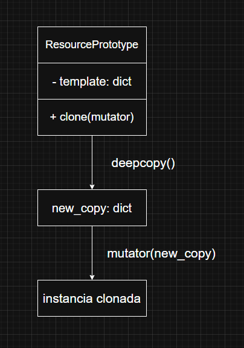

# Fase 1: Exploración y análisis

Para cada patrón, localiza el archivo correspondiente y responde (los códigos son de referencia):

### 1. Singleton

**Explica cómo SingletonMeta garantiza una sola instancia y el rol del lock.**

SingletonMeta garantiza una sola instancia porque controla la creación de objetos mediante su método __call__. Ahí verifica si la clase ya tiene una instancia guardada en _instances; si no existe, crea una nueva y la almacena, devolviendo siempre la misma en futuras llamadas.
El diccionario _instances actua como un registro central de instancias unicas por clase, el lock protege esta seccion critica del codigo cuando hay multiples hilos, evitando que mas de un hilo cree la instancia al mismo tiempo.
Así se asegura que incluso en entornos concurrentes solo exista una instancia global de la clase.

### 2. Factory

**Detalla cómo la fábrica encapsula la creación de null_resource y el propósito de sus triggers.**

La clase *NullResourceFactory* actua como una fabrica porque encapsula la logica para crear objetos null_resource de forma uniforme y controlada, sin que el resto del codigo deba conocer los detalles internos de su estructura.
El metodo estatico create() recibe un nombre y opcionalmente un diccionario de triggers, si no se proporcionan genera uno automaticamente con un identificador unico y una marca de tiempo.
Estos triggers sirven como atributos dinamicos que fuerzan la recreacion o actualizacion del recurso cuando cambian sus valores, algo muy util en entornos como Terraform.
En conclusion la fabrica centraliza la creacion y configuracion de recursos, asegurando consistencia y automatizacion en su generacion.

### 3. Prototype

**Dibuja un diagrama UML del proceso de clonación profunda y explica cómo el mutator permite personalizar cada instancia.**

El patron Prototype permite crear nuevos objetos copiando una plantilla existente, en lugar de instanciarlos desde cero.
Aqui, *ResourcePrototype* guarda un template y usa deepcopy para clonar toda su estructura (incluso objetos anidados), garantizando que la copia sea totalmente independiente del original.
El parametro **mutator** es una funcion que recibe la copia y la modifica, permitiendo personalizar cada clon sin alterar el prototipo base y asi se facilita la creación de multiples instancias con una estructura comun pero con variaciones especificas requeridas por el usuario.

**Diagrama:**

### 4. Composite

**Describe cómo CompositeModule agrupa múltiples bloques en un solo JSON válido para Terraform.**

**CompositeModule** implementa el patron Composite que permite tratar conjuntos de objetos como si fueran uno solo, en este caso cada "hijo" o block representa un fragmento de configuracion de Terraform con su propio diccionario {"resource": {...}}.
El metodo add() agrega estos bloques a la lista interna children, y export() los recorre para fusionar sus recursos en un unico diccionario merged.
Durante la exportacion combina las claves resource de todos los hijos, unificando sus tipos (rtype) y recursos dentro de una sola estructura coherente y el resultado final es un JSON compuesto y valido para Terraform, donde multiples modulos o recursos individuales quedan integrados en una sola definicion lista para desplegar.

### 5. Builder

**Explica cómo InfrastructureBuilder orquesta Factory -> Prototype -> Composite y genera el archivo JSON final.**

**InfrastructureBuilder** actua como un director del patron Builder, coordinando varios patrones para construir infraestructura de forma modular y automatizada.
1. Primero, usa Factory **(NullResourceFactory)** para crear un recurso base **(null_resource "app")**, encapsulando los detalles de su estructura.

2. Luego, aplica Prototype **(ResourcePrototype)** para clonar ese recurso base varias veces mediante **deepcopy**, usando un mutator que personaliza cada clon (renombrando "app" a "app_i").

3.  Cada clon se agrega al Composite **(CompositeModule)**, que agrupa todos los bloques en una sola estructura.

4. Finalmente, el metodo export() combina todo y lo escribe en un archivo JSON *(main.tf.json)*, obteniendo una definicion completa de infraestructura lista para usar en Terraform.
