# Actividad 2

#### 1) HTTP: Fundamentos y herramientas

1. **Levanta la app** con variables de entorno (12-Factor):
   `PORT=8080 MESSAGE="Hola CC3S2" RELEASE="v1" python3 app.py` (usa tu *venv*). 

   

   Tambien instale Flask con el comando `pip install flask` y verificar con `pip show flask
   
    Levantamos la aplicacion con `make run`:

    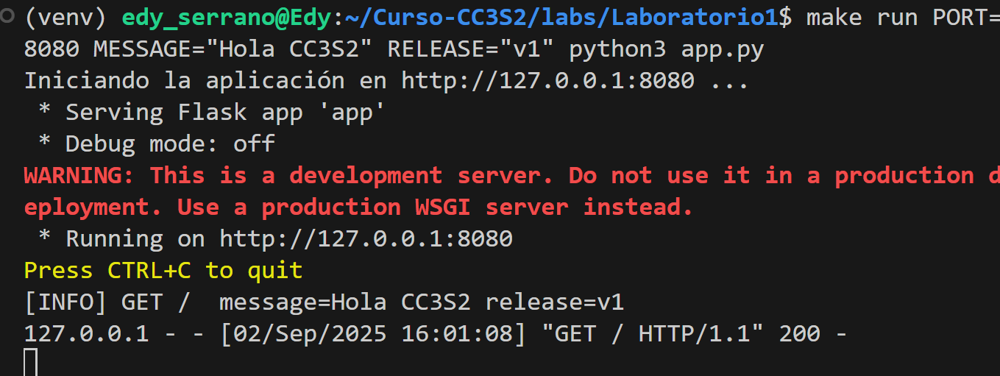

    verificamos:

    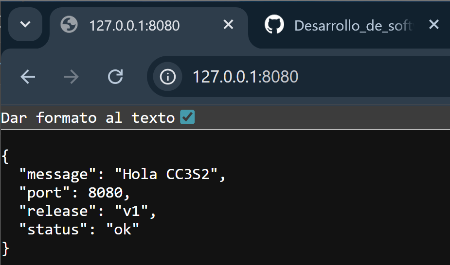

2. **Inspección con `curl`:**

   * `curl -v http://127.0.0.1:8080/` (cabeceras, código de estado, cuerpo JSON).

    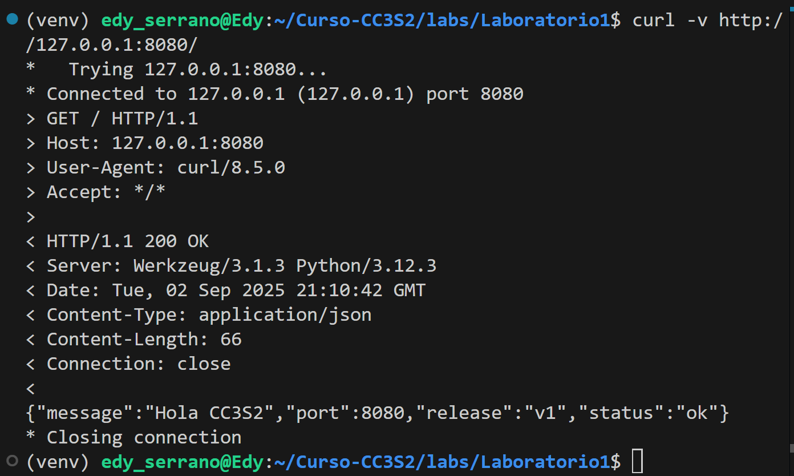

   * `curl -i -X POST http://127.0.0.1:8080/` 
   
   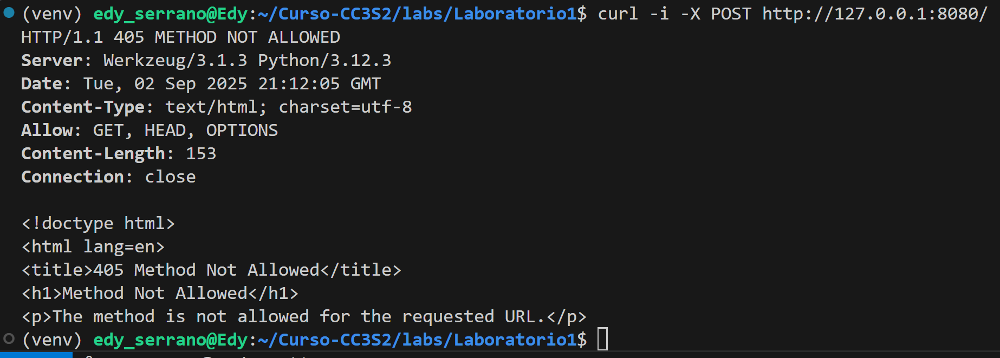

   En este caso no soportaria el metodo `POST` por eso nos muestra el codigo `405` y significa que *"el recurso existe, pero no admite ese metodo"* y muestra que solo esta permitodo `GET`, `HEAD` y `OPTIONS`.

   * **Pregunta guía:** ¿Qué campos de respuesta cambian si actualizas `MESSAGE`/`RELEASE` sin reiniciar el proceso? 
    Si actualizamos MESSAGE o RELEASE sin reiniciar la aplicación, la respuesta HTTP no cambia, seguira mostrando los valores iniciales porque las variables de entorno se leen solo al arrancar el proceso y se mantienen en memoria. 
    Para que la respuesta refleje los nuevos valores, es necesario detener y reiniciar la app con las variables actualizadas y esto es porque la configuración en 12-Factor App se inyecta en el arranque del proceso y no se recarga dinamicamente.

3. **Puertos abiertos con `ss`:**

   * `ss -ltnp | grep :8080` (evidencia del proceso y socket).

    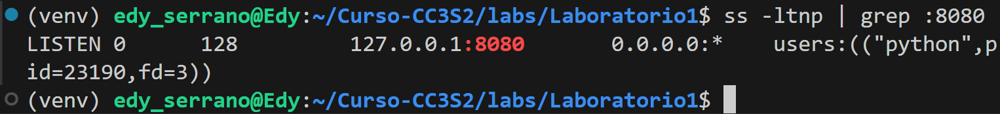

    * -l = listening

    * -t = TCP

    * -n = no resuelve nombres

    * -p = muestra proceso

4. **Logs como flujo:** Demuestra que los logs salen por stdout (pega 2–3 líneas). Explica por qué **no** se escriben en archivo (12-Factor).

    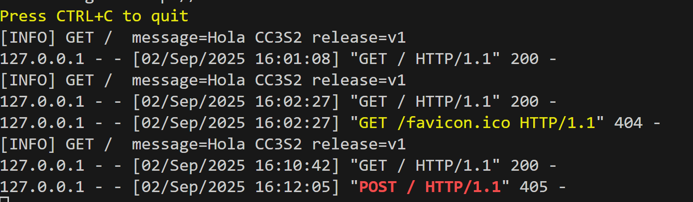

#### 2) DNS: nombres, registros y caché

**Meta:** resolver `miapp.local` y observar TTL/caché.

1. **Hosts local:** agrega `127.0.0.1 miapp.local` (Linux y/o Windows según tu entorno).

    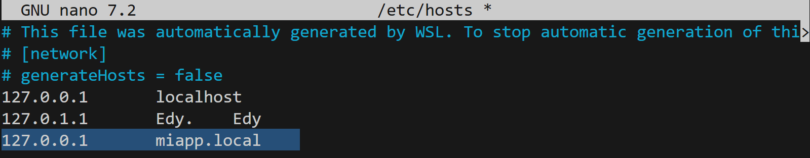

2. **Comprueba resolución:**

   * `getent hosts miapp.local` (muestra la base de resolución del sistema).

    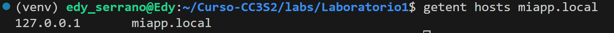

3. **TTL/caché (conceptual):** con `dig example.com A +ttlunits` explica cómo el TTL afecta respuestas repetidas (no cambies DNS público, solo observa).

    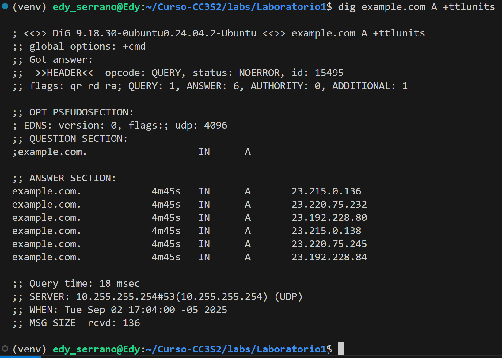

4. **Pregunta guía:** ¿Qué diferencia hay entre **/etc/hosts** y una zona DNS autoritativa? ¿Por qué el *hosts* sirve para laboratorio?

* `/etc/hosts` es un archivo local, estatico, y tiene prioridad inmediata en la resolucion de nombres en nuestra maquina.

* Una zona DNS se sirve desde servidores DNS y distribuye los registros a todo el mundo con control de TTL.

* Para laboratorio usamos `/etc/hosts` porque es rapido, simple y sin infraestructura.

#### 3) TLS: seguridad en tránsito con Nginx como *reverse proxy*

1. **Certificado de laboratorio:** genera autofirmado (usa el *target* `make tls-cert` si existe)

    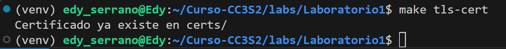

2. **Configura Nginx:** usa el ejemplo provisto para **terminación TLS** y **proxy\_pass** a `http://127.0.0.1:8080;` con cabeceras `X-Forwarded-*`. Luego `nginx -t` y **reinicia** el servicio.
Primero instalamos nginx con `sudo apt install -y nginx`.

    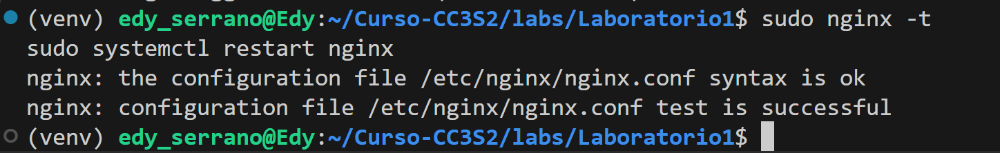

3. **Puertos y logs:**

   * `ss -ltnp | grep -E ':(443|8080)'` 

   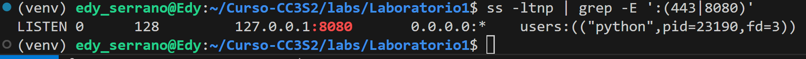
  

#### 4) 12-Factor App: port binding, configuración y logs

**Meta:** demostrar tres principios clave en tu app.

1. **Port binding:** muestra que la app **escucha** en el puerto indicado por `PORT` (evidencia `ss`).

    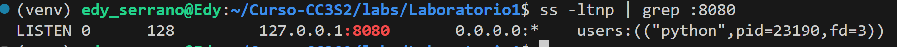

2. **Config por entorno:** ejecuta dos veces con distintos `MESSAGE`/`RELEASE` y documenta el efecto en la respuesta JSON.
    *   Primera ejecucion: `PORT=8080 MESSAGE="Hola CC3S2" RELEASE="v1" python3 app.py`

    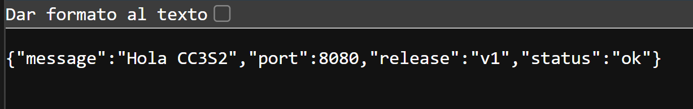

    *   Segunda ejecucion: `PORT=8080 MESSAGE="Otro mensaje" RELEASE="v2" python3 app.py`

   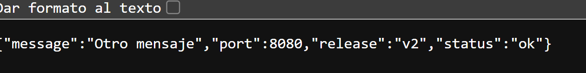 

3. **Logs a stdout:** redirige a archivo mediante *pipeline* de shell y adjunta 5 líneas representativas. Explica por qué **no** se configura *log file* en la app.

    * La app no configura archivos de log internos y siguiendo el 12-Factor, los logs se tratan como un flujo de eventos a stdout/stderr.

    * Esto asegura portabilidad: la app no depende de rutas de archivos ni del filesystem del host.

#### 5) Operación reproducible (Make/WSL/Linux)

Tabla "Comando -> Resultado esperado".

| Comando            | Resultado esperado                                                                 |
|--------------------|------------------------------------------------------------------------------------|
| `make prepare`     | Crea `venv`, instala Flask, deja entorno listo                                     |
| `make run`         | Arranca Flask en `127.0.0.1:8080` mostrando logs en stdout                         |
| `make nginx`       | Valida config Nginx y reinicia servicio (`systemctl` en Linux, `service` en WSL)   |
| `make check-http`  | Muestra cabeceras y cuerpo JSON en `http://127.0.0.1:8080/`                        |
| `make check-tls`   | Respuesta JSON en `https://miapp.local/` (ignora certificado con `-k`)             |
| `make dns-demo`    | `127.0.0.1` como IP de `miapp.local` |

Conclusion:

El uso de Make garantiza reproducibilidad: cualquier persona puede levantar el mismo flujo en otra maquina ejecutando los targets en orden, y tambien que las diferencias dependen del entorno (Linux nativo vs. WSL vs. Windows host).

#### Preguntas guía

1. **HTTP:** explica **idempotencia** de métodos y su impacto en *retries*/*health checks*. Da un ejemplo con `curl -X PUT` vs `POST`.

    * **Idempotente:** ejecutar varias veces produce el mismo efecto (GET, PUT, DELETE).
    * **No idempotente:** cada ejecucion cambia el estado ( POST).

    * **Impacto:** los metodos idempotentes son seguros para retries y health checks, porque no crean efectos secundarios extra.

2. **DNS:** ¿por qué `hosts` es útil para laboratorio pero no para producción? ¿Cómo influye el **TTL** en latencia y uso de caché?

    * El archivo hosts es util en laboratorio porque te permite resolver nombres de forma local sin depender de infraestructura DNS.

    * En produccion no escala ya que no hay distribucion automatica de cambios, y cada maquina tendria que editarse manualmente.

    * El TTL nos define cuanto tiempo un resultado DNS puede cachearse y si es alto, reduce latencia y trafico a servidores autoritativos; si es bajo, aumenta latencia y consultas.

3. **TLS:** ¿qué rol cumple **SNI** en el *handshake* y cómo lo demostraste con `openssl s_client`?

    * SNI (Server Name Indication) permite que un mismo servidor/puerto (443) sirva multiples certificados segun el nombre de host solicitado.

    * En el handshake, el cliente indica el servername, y Nginx selecciona ya el certificado correspondiente.

4. **12-Factor:** ¿por qué **logs a stdout** y **config por entorno** simplifican contenedores y CI/CD?;

    * Logs a stdout: simplifican contenedores porque no dependen de rutas de archivo.

    * Config por entorno: evita hardcodeo el mismo contenedor sirve para dev/test/prod, solo cambian las variables de entorno en CI/CD.

5. **Operación:** ¿qué muestra `ss -ltnp` que no ves con `curl`? ¿Cómo triangulas problemas con `journalctl`/logs de Nginx?;

    * El comando `ss -ltnp` muestra a nivel de sistema que puertos estan abiertos, que procesos los ocupan y en que estado estan, algo que `curl` no revela porque este solo prueba la respuesta HTTP de un servicio. 
    Para diagnosticar fallos, primero verificas con `ss` si el puerto realmente esta en escucha, luego usas `journalctl` o los logs de Nginx para ver mensajes de error.
