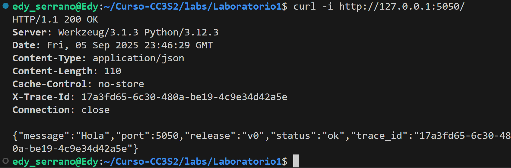

# Actividad 3: Integración de DevOps y DevSecOps con HTTP, DNS, TLS y 12-Factor App

Esta actividad cierra la unidad cubriendo los temas de Introducción a DevOps (qué es y qué no es, del código a producción), el marco CALMS, automatización reproducible con Linux/Bash y Make, la visión cultural de DevOps (comunicación y colaboración) y su evolución a DevSecOps, así como los módulos de redes y arquitectura (HTTP/DNS/TLS, puertos/procesos y metodología 12-Factor App).

## Parte teórica

### 1. Introducción a DevOps:
* **Qué es DevOps:** Una cultural y técnica que une los equipos de desarrollo y operaciones para entregar software de manera rapida, confiable y continua, y con automatización.

* **Qué no es DevOps:**

    * No es un conjunto de herramientas.
    * No es un rol o un departamento aislado.
    * No es “hacer más rápido lo mismo” sin cambiar cultura.

* **DevOps vs Waterfall**

    * **Waterfall:** Tiene fases rígidas -> requisitos -> desarrollo -> pruebas -> operación. Todo esto con un Feedback lento.

    * **DevOps:** flujo continuo desde código -> build -> pruebas -> despliegue -> monitoreo. En este caso es con Feedback inmediato.

* **"You build it, you run it"**

    * El mismo equipo que escribe el codigo se encarga de ejecutarlo y mantenerlo en produccion.

    * En el laboratorio: si defines un servicio en `systemd` o un `nginx.conf`, como desarrollador también debes monitorear su estado con `journalctl`y/o `systemctl status`.

* **Mitos vs realidades**

    * **Mito:** “DevOps es solo usar Docker, Jenkins, Kubernetes, sencillo”.

    * **Realidad:** DevOps se apoya en CALMS que es Cultura, Automatización, Lean, Medición, Sharing.

### 2. Marco CALMS en acción:
* **C – Culture (Cultura):** colaboración y evitar silos.

    * Ejemplo: `runbooks.md` para que todo el equipo sepa que hacer si un servicio falla.

* **A – Automation (Automatización):** reduccion de tareas manuales.

    * Ejemplo: Makefile con targets (`make prepare`, `make nginx`).

* **L – Lean:** entregar valor continuo y reducir desperdicio.

    * Ejemplo: solo desplegar servicios necesarios, evitar pasos manuales redundantes.

* **M – Measurement (Medición):** métricas y salud.

    * Ejemplo: endpoints /health en Flask o usar ss -ltnp para ver puertos activos.

* **S – Sharing (Compartir):** conocimiento compartido.

    * Ejemplo: postmortems guardados en repositorio (docs/postmortems/).

* Propuesta: Extender Sharing con guías rápidas (`runbooks.md`) y análisis de incidentes en equipo.

### 3. Visión cultural de DevOps y paso a DevSecOps:
* 
    * **Colaboración DevOps:** evita silos entre dev y ops y ahora trabajan juntos en automatización, despliegue y monitoreo.

    * **Evolución a DevSecOps:** Es añadir seguridad al flujo CI/CD desde el inicio.

* **Ejemplo de escenario retador:**

    * Certificado TLS caduca entonces la web deja de responder.

    * Mitigación cultural: El equipo comparte responsabilidad (no solo Ops) y se retroalimenta con feedbacks

* **3 controles de seguridad sin contenedores**

    1. **Cabeceras TLS/Nginx:** `nginx.conf` con `Strict-Transport-Security`, `X-Frame-Options`.

    2. **Escaneo de dependencias:** CI/CD con `pip-audit` o `npm audit`.

    3. **Control de procesos/systemd** limitar permisos en `nginx.service` (`User=nginx`, `ProtectSystem=yes`).

### 4. Metodología 12-Factor App:

1. **Config por entorno (III. Config):**

    * Debe ir en variables de entorno, no en código.

    * Falla: credenciales o puertos pueden estar hardcodeados.

2. **Port Binding (VII. Port binding):**

    * La app debe exponer un puerto y no depender de servidor externo.

    * Ejemplo: Flask en app.run (host="0.0.0.0", port=5000).

3. **Logs como flujos (XI. Logs):**

    * Logs deben ir a `stdout/stderr`, no a archivos locales.

    * Falla: si `Nginx` o `Flask` escriben en `/var/log/...`, puede perderse en ambientes de poca duracion.

4. **Statelessness (VI. Processes):**

    * La app no debe guardar estado en disco local.

    * Solución: usar backing services como Redis o DB externa.

    * Falla: si el laboratorio guarda sesiones en `/tmp`, se pierde al reiniciar.

## Parte práctica

### 1. Automatización reproducible con Make y Bash (Automation en CALMS).
1. **Ejecutamos el make file:**
    * `make prepare`:
        

    * `make hosts-setup`:
        

    * `make run`:
        

    * `make check-http` verifica la conexion (Todo ok):
        

2. **Lean:**

    El principio Lean busca minimizar fallos, por ejemplo:
    * Con `Makefile`, evitas repetir comandos manuales.

    * Con reintentos HTTP (`curl --retry`), evitas que un fallo temporal interrumpa y afecte a todo el pipeline.

    * Con `cleanup`, garantizas que cada ejecucion empieza en un estado limpio.

3. **Tabla de rastreo de objetivos:**

    | Objetivo (Make)    | Prepara / Verifica                                                                 | Evidencia (captura o salida)                                                                 |
    |---------------------|------------------------------------------------------------------------------------|----------------------------------------------------------------------------------------------|
    | `make deps`        | Instala dependencias necesarias para la app                                        |   |
    | `make run`         | Levanta la aplicación Flask en el puerto configurado                               | Mensaje: `Running on http://127.0.0.1:5000/`  |
    | `make hosts-setup` | Configura resolución local para el dominio de la app                               | Captura del archivo `/etc/hosts`  |
    | `make check-http`  | Verifica que la app responde de forma idempotente con reintentos HTTP              | Captura mostrando respuesta `200 OK`                          |
    | `make cleanup`     | Elimina archivos temporales y detiene servicios                                    | Captura mostrando procesos Flask detenidos y carpetas limpias (`ls` sin __pycache__)         |

4. **Ejercicio retador:**
Intenta romper el Makefile cambiando una variable y observa si sigue siendo reproducible.

    Para este ejercicio intentare **romper** el `Makefile` cambiando una variable con `make run APP_PORT=6000`.

    

    Ahora verificamos con `make check-http APP_PORT=6000` y notamos que sigue funcionando, lo que demuestra que el sistema es reproducible y configurable y esta alineado con CALMS.

    

### 2. Del código a producción con 12-Factor (Build/Release/Run).
1. **Modifica variables de entorno (PORT, MESSAGE, RELEASE):**
Modificaremos **PORT:3333**, **MESSAGE:Hola DevOps UNI!**, **RELEASE:v2.1**

    

2. **Artefacto inmutable con Git**

    Ahora usare `git archive` para crear una copia `.zip` del laboratorio, la diferencia con `git clone` es que, `git archive` no copia el historial de commit y solo se sentra en los archivos.

    

    Luego vamos a descomprimir y nombrarlo `app-release`:

    

    Ahora vamos a navegar y hacer `ls` para observar que los archivos se descomprimieron y estan todos completos:

    

3. **Tabla de variables de entorno y efectos**
    ## Tabla de variables (Build/Release/Run)

| Variable   | Efecto observable en la app                                     |
|------------|------------------------------------------------------------------|
| `PORT=3333`| La app se expone en `http://localhost:3333` (verificable con `ss -lnt`) |
| `MESSAGE="Hola DevOps UNI!"` | Al abrir `/` devuelve `Hola DevOps UNI! (release: V2.1)`              |
| `RELEASE=v2.1` | La ruta `/` muestra `(... release: v1.2.3)` -> indica versiOn desplegada |

4. **Fallo de backing service**
    Haremos que la app dependa de una base de datos en `localhost:1234` pero se configure mal:

    

    Notamos que falla rapido, para solucionarse se debe reinicial y se encontrara en un estado limpio y sin corrupcion.

    

### 3. HTTP como contrato observable.

1. **Operaciones seguras para reintentos**
    En REST/HTTP:

    * Seguras e idempotentes:

        * GET (no cambia el estado).

        * PUT (escribir lo mismo).

        * DELETE (eliminar recurso -> mismo resultado aunque se repita).

    * No idempotente:

        * POST (cada repetición crea un nuevo recurso).
2. **Readiness y Liveness simples**

    * Implementamos en `app.py`:
        

    * Ahora medimos latencia con `curl`:
        
3. **Contrato minimo**

    * Probamos con `curl -i` para ver headers y cuerpo:
        

4. **6. Definir un SLO (Service Level Objective)**

    Un SLO es el objetivo medible del servicio. Ejemplo:

    * **Disponibilidad:** 99.9% de las peticiones a `/readyz` deben devolver `200 OK`.

    * **Latencia:** El 95% de las respuestas deben tener `time_total < 200ms`.

    * **Errores:** Menos del 0.1% de las peticiones a `/api/*` deben devolver `5xx` (error).

### 4. DNS y caché en operación.

1. **Configurar IP estatica en Netplan**

    

2. **Observar TTL con dig**

    * **dig (Domain Information Groper)**

        * Sirve para consultar servidores DNS y ver como se resuelve un nombre de dominio.

        * Muestra detalles tecnicos: registros (A, AAAA, MX, NS), el TTL, la seccion autoritativa y si la respuesta viene de cache o no.

    

    * **getent (get entries)**
        * Consulta la base de datos NSS (Name Service Switch) de Linux, que integra varias fuentes de resolucion como `/etc/hosts`, DNS y NIS.

3. **Camino DNS en operación**

    Cuando consultas un dominio, el flujo es:

    1. **Stub resolver:** la libreria de tu que recibe la query.

    2. **Recursive resolver (recursor):** tu DNS configurado (como 8.8.8.8) busca la respuesta.

    3. **Autoritativos:** servidores responsables del dominio (como .com -> google.com -> www.google.com).

    Para miapp.local:

    * No hay zona publica.

    * El sistema resuelve directamente desde /etc/hosts (override local).

4. **Cacheadas vs Autoritativas**

    * **Respuesta cacheada:** viene del recursor, TTL decrece con cada consulta (Time To Live).

    * **Respuesta autoritativa:** viene directo del servidor DNS del dominio, TTL se reinicia en su valor original.

### 5. TLS y seguridad en DevSecOps (Reverse Proxy).

1. **Generacion de certificados**

    

2. **Terminación TLS y flujo**
    * Cliente cifra hasta Nginx (:443).

    * Nginx termina la sesión TLS (descifra).

    * Reenvía tráfico en plano a `127.0.0.1:8080`.

    * Cabeceras `X-Forwarded-*` preservan contexto de cliente.

3. **Entorno laboratorio vs. producción**

    * **Laboratorio:** certificado autofirmado, solo TLS 1.3, pruebas internas.

    * **Producción:** certificado de CA publica puede permitir TLS 1.2 por compatibilidad con clientes antiguos, pero se endurece con TLS 1.3 por defecto y HSTS forzado.

4. **Gate de CI/CD: “TLS mínimo v1.3”** 
    * Detectar la versión efectiva TLS del endpoint con un pipeline:
    
    

    En este caso falla por no cumplir TLS 1.3 el cual o esta habilitado.

### 6. Puertos, procesos y firewall. 

1. **Listar puertos y procesos**
    Con `ss` y `lsof` puedo obtener que servicios escuchan en que interfaces:
    * con `ss-ltnp` puedo ver puertos con escucha en proceso

        

    * Y con lsof tambien:

        

2. **Conexiones activas**
    * Para ver las conexiones activas uso `ss -tnp`:

        

3. **Tests de confirmacion**
    * **Externo:**

        

        Aqui falla (rechazo/conexión denegada) porque es interna.

    * **Interno:**

        

### 7. Integración CI/CD
Creamos un script bash
1. **Verifica DNS**

    

2. **Verifica HTTP (respuesta 200)**

    

3. **Verifica TLS (certificado valido)**

    

4. **Medir latencia**

    

* Ejecutamos: `bash check_pre_deploy.sh miapp.local 443 0.5`

    

### 8. Escenario integrado y mapeo 12-Factor.
    Segun lo pedido:
    En este ejercicio deberás trabajar con un endpoint de la aplicación (por ejemplo, GET /) y modificarlo conceptualmente para introducir un fallo no idempotente, es decir, que al repetir la misma solicitud se altere el estado o la respuesta. La evidencia debe mostrar cómo dos peticiones idénticas generan resultados distintos y por qué esto rompe la idempotencia, afectando reintentos, cachés y balanceadores.

    Posteriormente, realiza un despliegue manual tipo blue/green, manteniendo dos instancias: una estable (Blue) y otra con el fallo (Green). Documenta cómo harías la conmutación de tráfico de Blue a Green únicamente si pasa los chequeos de readiness y liveness, y cómo ejecutarías un rollback rápido si se detecta el problema.

1. **Modificamos el `/`:**
    *  El endpoint "/" ahora incrementa y devuelve un contador en cada peticiOn, mostrando que dos solicitudes idEnticas generan respuestas distintas, lo que rompiendo la idempotencia.

        

    * Ahora realizamos peticiones identicas a `GET/` para que el campo counter incremente de 3 a 4 y luego a 5, lo que demuestra que el endpoint ya no es idempotente.

        
    
    * **Impacto:**
        * Reintentos: Si un cliente reintenta la peticion, el estado cambia inesperadamente.

        * Caches: No se puede cachear la respuesta, ya que cada llamada es distinta.

        * Balanceadores: Si hay varios servidores, el contador puede no ser consistente, generando respuestas aun mas impredecibles.

2. **Despliegue manual blue/green**

    * Primero ejecutamos cada uno en 2 puertos diferentes:

        * **blue:** 8080 (`export PORT=8080 python app.py`)
            
        * **green:** 8081 (`export PORT=8081 python app.py`)
            

    * Para realizar el cambio de green a blue y viceversa en el archivo `miapp.conf` colocamos los 2 puertos y comentamos 1, para asi modificarlo cuando necesitemos cambiar de puerto:

        

3. **Monitoreo y verificación**

* Realiza pruebas funcionales y monitorea logs.
* Si todo está bien, Green queda como nueva versión estable.

4. **Rollback rápido (Green -> Blue)**
si se detecta un problema:
    * Vuelve a editar el bloque upstream para apuntar a Blue.
    * Recarga nginx con `sudo nginx -s reload`

## Postmortem: Incidente de No Idempotencia en Endpoint `GET /`
1. **Resumen del Incidente:**
    El 5 de septiembre de 2025,en un despliegue blue/green, se detecto que el endpoint GET / dejo de ser idempotente, y ahora retornaba un contador incremental en cada solicitud, esto genero inconsistencias en reintentos, caches y balanceadores.

2. **Linea de Tiempo:**
    * 10:00 — Se despliego Green (nueva version) en puerto 8081.
    * 10:05 — Se conmuta el tráfico de Blue a Green.
    * 10:15 — Usuarios y sistemas de monitoreo reportan respuestas inconsistentes.
    * 10:20 — Se identifica que el endpoint GET / ya no es idempotente.
    * 10:22 — Se procedio a ejecutar el rollback a Blue (puerto 8080).
    * 10:25 — Servicio se restablecido y es estable.

3. **Impacto en Usuarios:**
    * Respuestas distintas ante solicitudes identicas.
    * Fallos en caches y balanceadores.
    * Reintentos automaticos generaron estados inesperados (diferentes).
    * Potencial perdida de confianza en la API.

4. **Causa Raiz:**
    * Introduccion de un contador global en el endpoint GET /, rompiendo la idempotencia.
    * Falta de pruebas automaticas para idempotencia antes del despliegue.

5. **Lecciones Aprendidas**

    * **Tecnicas:**

        * Los endpoints GET deben ser idempotentes y no modificar estado.
        * Es necesario automatizar pruebas de idempotencia en CI/CD.

    * **Culturales:**

        * Fomentar la revision de codigo y pruebas entre 2 o mas personas.
        * Promover la cultura de “fail fast, recover faster”.

6. **Acciones Preventivas (DevSecOps)**

    * Añadir pruebas automaticas de idempotencia en CI/CD.
    * Revisar endpoints antes de cada despliegue.
    * Incluir validaciones de seguridad para evitar cambios de estado no autorizados en GET.

**MI GUIA:** https://developers.googleblog.com/en/google-api-infrastructure-outage-incident-report/

## Runbook: Respuesta ante Incidente de No Idempotencia

1. Verifica el reporte de error o inconsistencia en respuestas. 
2. Confirma el comportamiento no idempotente con dos peticiones GET identicas. 
3. Ejecuta chequeos de readiness/liveness en ambas instancias (Blue y Green). 
4. Edita el archivo nginx para conmutar el trafico de Green a Blue (estable). 
5. Recarga nginx: `sudo nginx -s reload`
6. Monitorea que las respuestas vuelvan a ser consistentes. 
7. Notifica al equipo y procede a documentar el incidente. 
8. Inicia revision de codigo y agrega pruebas automaticas para prevenir un error similar.

## Tabla de Seis Factores de 12-Factor App

| Factor         | Principio                                                                 | Implementación en el laboratorio                                   | Evidencia recogida                                              | Mejora propuesta para producción                                 |
|----------------|---------------------------------------------------------------------------|--------------------------------------------------------------------|------------------------------------------------------------------|------------------------------------------------------------------|
| Codigo base    | Una base de codigo por `app`, rastreada en control de versiones             | Un solo repositorio y directorio para la app y scripts             | Estructura unica, Makefile, versionado de archivos               | Integrar CI/CD con control de versiones |
| Configuracion  | `Config` en variables de entorno, no en el codigo                           | Uso de *os.environ* para `PORT`, `MESSAGE`, `RELEASE` en `app.py`            | Cambios de puerto y mensaje sin modificar codigo fuente          | Usar un gestor de secretos y variables seguras                   |
| Dependencias   | Declarar y aislar dependencias     | Uso de `venv`  | Estructura de `venv`, binarios en `bdd/cces2`        | Automatizar revision de dependencias                |
| Backing services| Tratar servicios externos como recursos                         | Uso de archivos de configuracion para `nginx`, `systemd`, `netplan`      | `nginx.conf`, `miapp.service`                      | Externalizar servicios (DB, cache) y parametrizar endpoints      |
| Procesos       | Ejecutar la app como uno o mas procesos sin estado                        | Flask ejecutado como proceso unico, sin guardar estado en disco    | `app.py` no guarda archivos, contador solo en memoria              | Usar contenedores y orquestadores para escalar procesos          |
| Logs           | Tratar logs como flujos de eventos                                        | print a stdout en `app.py`, `logs` visibles en consola y `systemd`       | En `stdout`, `journalctl` muestra logs                        | Centralizar logs  y alertas automaticas               |
