# Laboratorio 1: HTTP + DNS + TLS para DevOps/DevSecOps con Make

Este laboratorio te guía por HTTP, DNS (A/AAAA, CNAME, TXT, MX, SRV), TTL y cachés, y TLS de forma reproducible.
Integra curl, dig, ss, openssl, lsof, ip, getent, resolv.conf, Netplan (IP estática), UFW, Nginx (reverse proxy) y una unidad de systemd.
La aplicación sigue la metodología 12-Factor App (configuración por variables de entorno, port binding, logs como flujos).

**Requisitos previos:**

Sistema tipo Ubuntu/Debian con: `python3-venv`, `nginx`, `ufw (opcional)`, `dnsutils (para dig)`, `lsof`, `iproute2`, `openssl`.

## Guía por sistema operativo Windows 10/11 + WSL2 (Ubuntu) + Visual Studio Code (Remoto WSL):

### 1. Instalar WSL + Ubuntu (si no lo tienes)
* Abre PowerShell (Administrador) y ejecuta:

    ``` bash
        wsl --install -d Ubuntu
    ```
    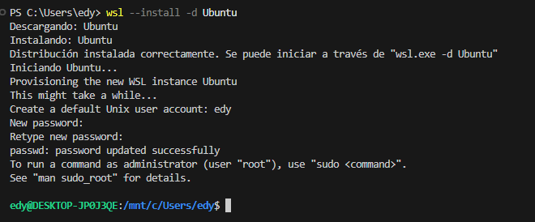

### 2. Instalar VS Code (Windows) y la extensión WSL
* Dentro de VS Code, instala la extensión WSL:

    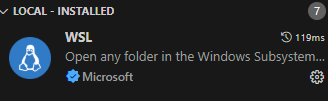

### 3. Abrir una ventana de VS Code conectada a WSL

* Presiona `Ctrl+Shift+P` -> “WSL: New WSL Window”.

    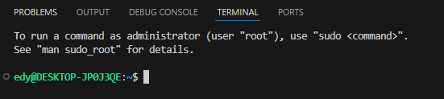

### 4. Copiar o clonar el proyecto dentro de WSL (evitar /mnt/c)

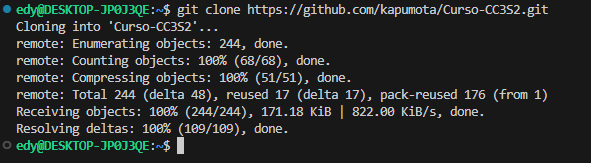

### 5. Instalar paquetes y ejecutar (igual que en Linux)

* Primero instalamos make con el comando `sudo apt install make`:

    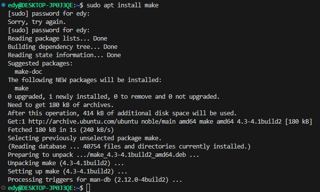

* Una vez instalado, entramos dentro de la carpeta donde se encuentran los recursos del laboratoria 1 y ejecutamos los comandos siguientes para explorar bash.

### 5.1. `make help`
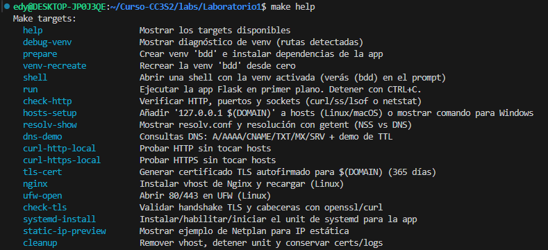

Lista los comandos disponibles, es una guia.

### 5.2. `make prepare`

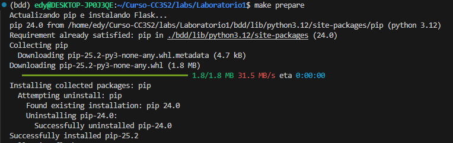

### 5.3. `make hosts-setup`

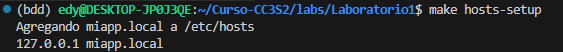

### 5.4. `make run` deja esta terminal abierta

En una nueva terminal de VS Code (WSL):

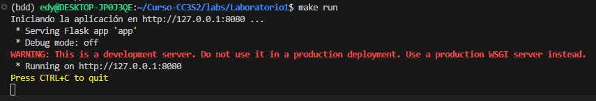

### 5.5. `make check-http`

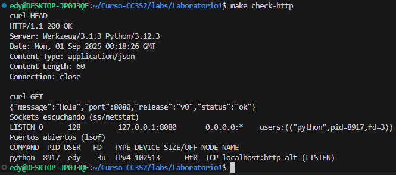

### 5.6. `make tls-cert`

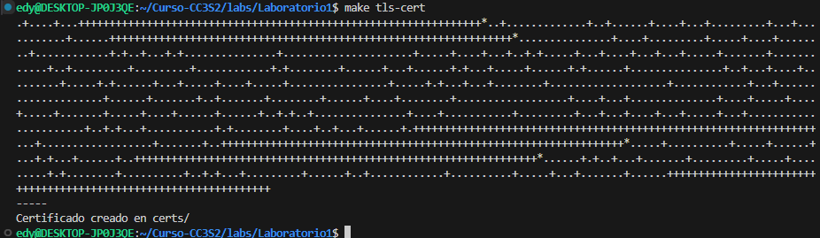

### 5.7. `make nginx`

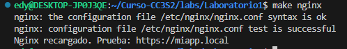

### 5.8. `make check-tls`

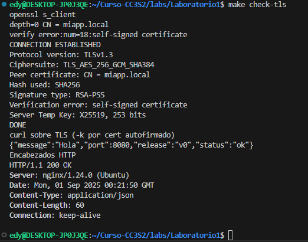

Estos comandos automatizan la preparación y validación de tu entorno:

* **make prepare:** crea entorno virtual e instala dependencias.

* **make hosts-setup:** configura /etc/hosts.

* **make run:** levanta la app.

* **make check-http:** prueba acceso HTTP.

* **make tls-cert:** genera certificados TLS.

* **make nginx:** configura Nginx con TLS.

* **make check-tls:** valida acceso HTTPS.

